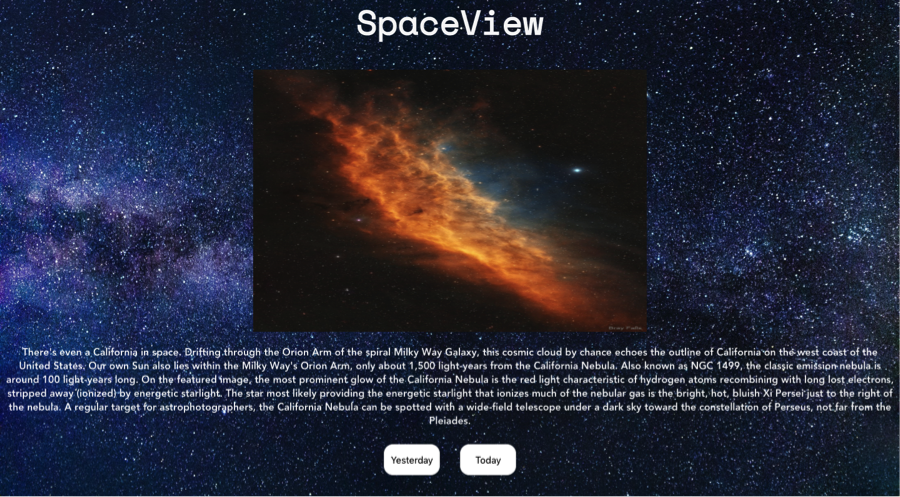

# final-countdown

## Description

Final-Countdown is an application that allows the user to view the two most recent Astronomy Pictures of the Day from NASA's APOD API as well as a description of each. This application was built with Vue.js and tested with Jest.

## Project setup

1. clone down this repository.

2. `npm install`

3. `npm run serve`

## User Interface

